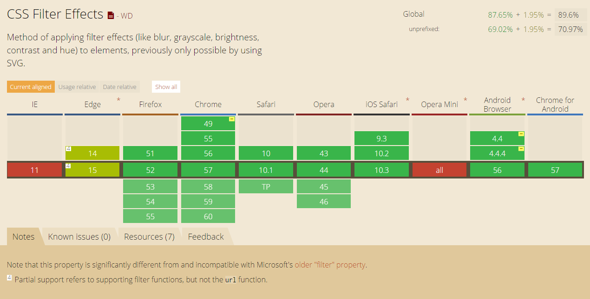
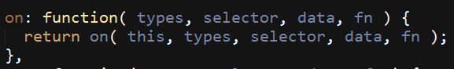
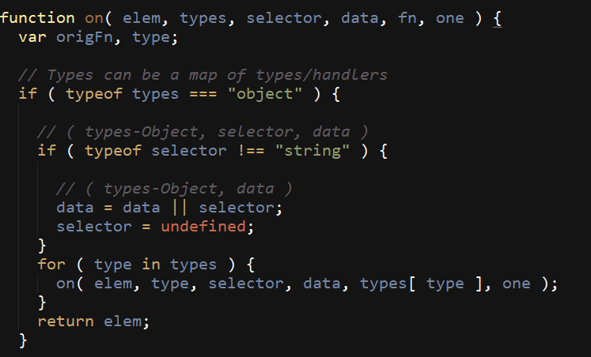
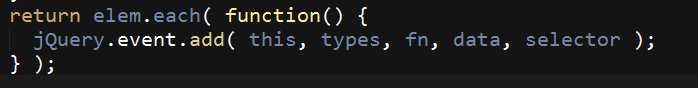

## 问题汇总和日常总结

*	https 协议下安卓端默认不加载 http协议请求
	* 解决办法 [https://segmentfault.com/q/1010000004727822](https://segmentfault.com/q/1010000004727822)
	* 我的解决办法是（把图片的域名更整体更换成https）
*	zepto touch（最新版） 在chrome 55会tap事件会触发两次[zepto issue](https://github.com/madrobby/zepto/issues/1249)
	* [github zepto issue double tap](https://github.com/madrobby/zepto/issues/1249) 最后选择用 @MarvinXu 的方法移除所有pointer事件，成功解决，tap在chrome上触发两次的问题。
*	zepto 获取input checkbox 是否选中 获取不到
	*	需要引入zepto的`selector.js`模块
*	【错误处理】:Uncaught SyntaxError: Invalid or unexpected token
	* 这个错误是因为，js代码中存在非英文标点符号（仔细检查下代码）
*	[css中有些属性的前面会加上`*`或`_`分别代表什么意思？](http://blog.csdn.net/yohoph/article/details/7759372)
	* 这些是IE6，IE7，IE8，Firefox兼容的css hack	
	* 很多css hack，最重要的是简单实用能解决问题就行了。
	* `\9`：IE6/IE7/IE8
	* `*`：IE6/IE7
	* `_`：IE6
	* `*+`：IE7
	* 先看一个例子：

```css

color {
	background-color: #CC00FF; /* 所有浏览器都会显示为紫色 */
	background-color: #FF0000\9; /* IE6、IE7、IE8会显示红色 */
	*background-color: #0066FF;  /* IE6、IE7会变为蓝色 */   
	_background-color: #009933;  /* IE6会变为绿色 */
}

```

*	image跨域访问问题
	* canvas 调用drawImage方法会出现	
	* 我的解决办法是把图片转成base64（缺点，如果图片很大会增加页面代码量）
	* [segmentfault 上的解决办法](https://segmentfault.com/q/1010000000768672)
	* [MDN 解决方案](https://developer.mozilla.org/en-US/docs/Web/HTML/CORS_enabled_image)

```
Image from origin 'http://sdimage.b0.upaiyun.com' has been blocked from loading by Cross-Origin Resource Sharing policy: No 'Access-Control-Allow-Origin' header is present on the requested resource. Origin 'http://localhost:3000' is therefore not allowed access.

```

*	`document.referrer` (**同一个域名下**获取本页面上一个页面的地址信息，若没有则返回空字符串)
*	使用Js去除“内容”的前后空格

```js

function Trim(str)
{ 
 	return str.replace(/(^\s*)|(\s*$)/g, ""); 
}

// 如果使用jQuery直接使用$.trim(str)方法即可，str表示要去掉前后所有空格的字符串

```

*	去掉字符串中所有空格（包括中间空格）

```js

 function Trim(str,is_global)
{
    var result;
    result = str.replace(/(^\s+)|(\s+$)/g,"");
    if(is_global.toLowerCase()=="g")
    {
        result = result.replace(/\s/g,"");
     }
    return result;
}

```

*	刚刚收到腾讯新闻的一条推送，86西游记的杨洁导演去世了。怀着悲痛的心情，赶紧去百度百科上检索下杨洁这个人的履历。发现这个页面整体都是灰色的，果断按了下F12（旁边的同事说我：这是病啊，老板）即发现了下面这段代码（是页面整体变灰）：

```css

/* 采用css3的灰度过滤，是页面整体变灰 */
body.memorial {
    filter: grayscale(100%);
    -webkit-filter: grayscale(100%);
    -moz-filter: grayscale(100%);
    -ms-filter: grayscale(100%);
    -o-filter: grayscale(100%);
    filter: progid:DXImageTransform.Microsoft.BasicImage(grayscale=1);
    -webkit-filter: grayscale(1);
}

```

**兼容性：**[CSS Filter Effects](http://www.caniuse.com/#search=filter)



*	jquery可以重复绑定相同事件到同一个元素上！！（所以你要确保每个元素身上只绑定了一个事件）这是[stackoverflow 上的解决方案](http://stackoverflow.com/questions/14969960/jquery-click-events-firing-multiple-times)
> 通过这个问题衍生的一些问题：jquery `on`方法绑定事件的原理，是放在一个数组里面的，触发的时候循环数组里面的事件，所以会触发多次。
> 
> 这里还有dom0级事件和dom2级事件（https://github.com/smileyby/dom0_dom2）

这里有必要科普下jquery源码中，on方法的实现原理：







> 上面贴出的部分jquery源码，可以看到on方法中，事件之所以可以一次绑定多个，是因为jquery是用“for”循环绑定你所添加的事件
> 
> 其次，在给同一个元素绑定相同事件不发生覆盖的原因是：jquery调用each方法还是循环去添加事件。
> 
> 其底层的事件添加采用的是dom2级事件，即addEventListener来实现。addEventListener本身就是可以绑定多个相同事件在同一个元素身上。所以就出现的，当你给一个元素重复绑定相同事件不发生覆盖的情况。
> 
> 不了解addEventListener为什么可以绑定多个事件的，可以参考：https://github.com/smileyby/dom0_dom2

* 今天和安卓对接的时候发现，安卓端接收字符串和数字的处理方式不一样，我用js调用安卓方法，传递参数为字符串1，但安卓端接收到的确实0（奇怪啊）。
* transform-origin  的位置会受元素display属性影响 http://codepen.io/airen/pen/Jdvbgr 

* PHPError PHP 5.6 中 Automatically populating $HTTP_RAW_POST_DATA is deprecated and will be removed in a future version
* 解决办法：找到php.ini  文件， 把always_populate_raw_post_data  修改为-1 就行了。`always_populate_raw_post_data=-1` 参考链接：[https://www.bram.us/2014/10/26/php-5-6-automatically-populating-http_raw_post_data-is-deprecated-and-will-be-removed-in-a-future-version/](https://www.bram.us/2014/10/26/php-5-6-automatically-populating-http_raw_post_data-is-deprecated-and-will-be-removed-in-a-future-version/)

* input type=file 其中files属性为只读，不可修改

* 很久没有数据的方法，有点生疏了，在这里记录下`concat`拼接两个数组的时候返回值是拼接后的新数组，`push`向数组最后添加元素，返回值是新数组的长度。（不清楚这两个小东西的返回值，被自己坑了一把）
	

## 有趣网址收集

http://k.swao.cn/js/web/game/t_01/level_01/step1.html

http://weavesilk.com/?tgxl

https://www.douban.com/group/topic/27093596/?type=like

http://whxaxes.github.io/canvas-test/src//Funny-demo/netparticle/net_2.html

## 实用工具收集

http://www.ilovepdf.com/zh_cn   pdf文件转换

https://www.17ce.com/  测试网址在各个地区的响应情况
